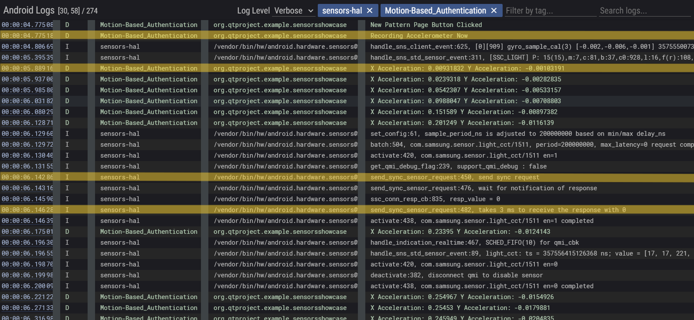
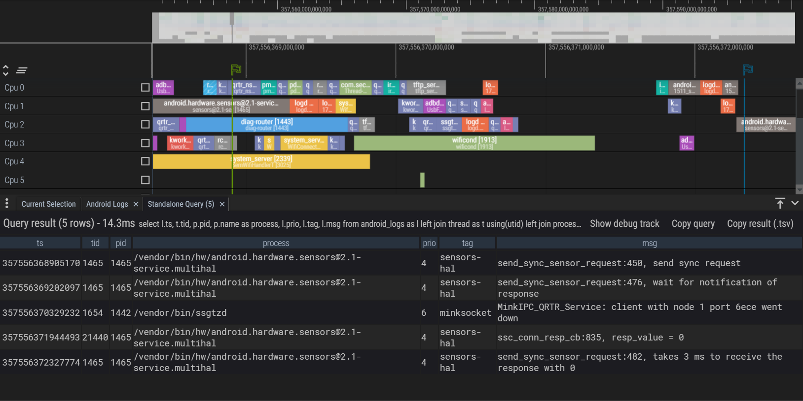
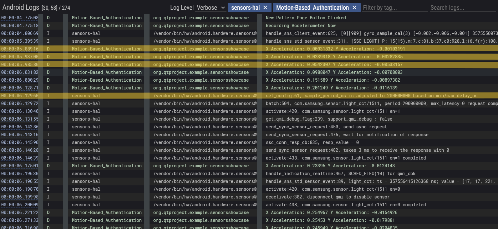
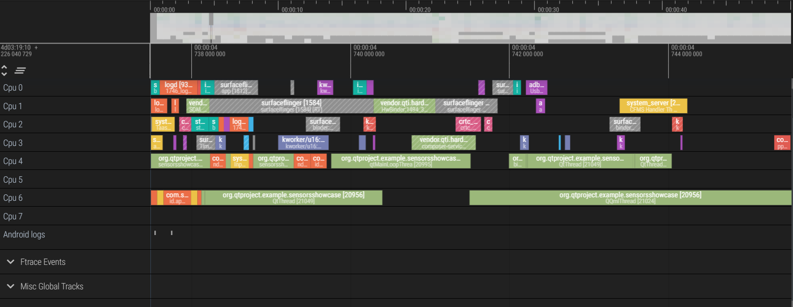
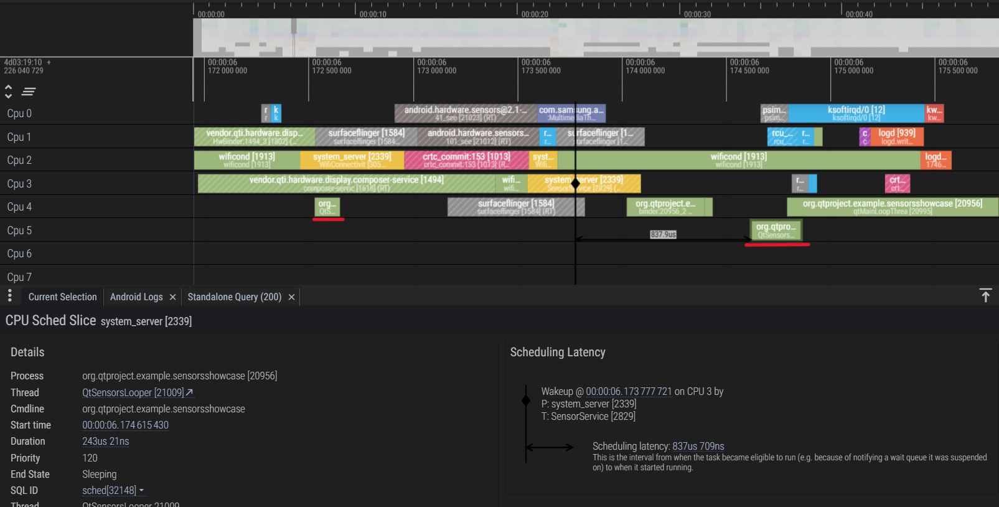

# Questions and Answers

## Perfetto

Perfetto is a powerful tracing tool that allows developers to collect detailed system-level performance data from Android devices. By using Perfetto, developers can analyze system behavior, identify performance bottlenecks, and optimize their applications for better efficiency and responsiveness. In this section, we will explore some key questions related to system-level performance analysis using Perfetto and sensor data processing in Android applications.

### What happens at the operating system level from the time a request is made to read data from a sensor until the data is obtained And how much time has passed?

The Sensors Hardware Abstraction Layer (HAL) is the interface between the Android sensor framework and a device's sensors, such as an accelerometer or gyroscope. The Sensors HAL defines the functions that must be implemented to allow the framework to control the sensors. As you can see in the following image, the sensor sends a request at 00:00:06.1428 and the data is obtained at 00:00:06.1462, so the time passed is 3ms. We also see from the system log that "Recording Accelerometer" starts at 00:00:04.775 and receives the sensor data at 00:00:05.889, so the time passed is 1.114s. At the operating system level, when a request is made to read data from a sensor, the request first goes through the Android sensor framework, which communicates with the Sensors HAL. The HAL interacts with the sensor hardware to retrieve the requested data. Once the data is ready, it is passed back through the HAL to the sensor framework, and then to the application that made the request. This entire process includes initial setup, configuration, actual data retrieval, and the eventual delivery of data to the application. The logs indicate the efficiency of the HAL and the sensor framework in processing these requests within the mentioned time frames.

Operating System Layer:

- Sensor Manager: The application requests sensor data (accelerometer and gyroscope) through the Android SensorManager.

- Sensor HAL (Hardware Abstraction Layer): The SensorManager communicates with the Hardware Abstraction Layer (HAL). The HAL acts as a bridge between the app and the actual sensor hardware.

- Sensor Driver: The HAL interacts with the specific sensor driver for the accelerometer and gyroscope. This driver controls the sensor hardware and translates low-level signals into a format the OS understands.

- Delivery to SensorManager: The sensor driver delivers the processed sensor data back to the SensorManager.

Delivery to App:

- SensorEventListener: The application implements a SensorEventListener that receives notifications when new sensor data is available.

- onSensorChanged: The SensorManager calls the app's onSensorChanged method within the SensorEventListener, passing the latest sensor data.

This is the result of what happend at Operating System level:

### Compare the time between reading two consecutive data from the sensor in Perfetto with the sampling period that you have configured in your code.

As we can see in the following image, the sensors HAL sample period is adjusted to 200ms based on max delays. However, we see in the previous question that it takes 3ms to read two data from the sensor. The sampling rate is configured to 50ms in our code which we can see it in the image. So the time between reading two consecutive data from the sensor in Perfetto is less than the sampling period that we have configured in our code. This is because the sensors HAL is a hardware sensor and it is faster than the software sensor that we have implemented. Additionally, the actual intervals observed in the Perfetto logs, which range from 46 to 58 milliseconds, indicate that despite the configured sampling period of 50 milliseconds, the hardware sensor's efficiency and the Android system's internal optimizations allow for faster data collection. If the time difference between the two successive readings in the Perfetto trace matches or is close to the expected interval of 50 milliseconds, it indicates that the sensor data is being captured at the expected data rate. Any significant deviation from the expected interval could indicate variations in the sensor data capture process, such as missed readings or irregular timing.

Note that as the [Qt Documentation](https://doc.qt.io/qt-6/qsensor.html#dataRate-prop) mentioned, there is no mechanism to determine the current data rate in use by the platform.

### Does the expectation of busy waiting thread until another thread finishes its work in system calls conflict with processing, such as using the graphics library and updating sensors? Justify your answer.

Busy waiting is a technique where a thread repeatedly checks for a condition to be true, without performing any other useful work. This can be inefficient and resource-intensive, as the thread consumes CPU cycles while waiting for the condition to be met. In the context of system calls, busy waiting can lead to high CPU utilization and reduced performance, as the thread is constantly checking for the completion of another thread's work.

When multiple threads are involved in processing tasks like using a graphics library and updating sensors, conflicts can arise due to shared resources, such as memory, CPU time, and I/O operations. For example, if a thread is busy waiting for another thread to finish updating sensor data, it may prevent the graphics library from accessing the required resources, leading to delays or resource contention. So, yes, there can be conflicts in system calls between processes.

Reasons Why Conflicts Might Be Mitigated:

- Sensor Event Queues: Android uses sensor event queues. The sensor data isn't delivered directly to your app when requested. Instead, the sensor driver places the data in a queue. Your app's onSensorChanged method is called only when new data arrives in the queue, minimizing CPU usage by your app for waiting.

- Non-Blocking I/O: Modern operating systems often employ non-blocking I/O for sensor access. This means your app doesn't block (busy wait) waiting for sensor data. Instead, the OS can notify your app when new data is available in the queue. This allows other processes to run uninterrupted.

- Thread Priorities: The OS typically assigns priorities to threads. Sensor update threads might have a lower priority than graphics libraries, reducing the chance of priority inversion impacting performance.

### Compare the processing time required for sensor data with the time of other CPU processes.

Sensor data processing typically takes a much shorter time compared to other CPU processing tasks in mobile applications. It is a relatively lightweight task compared to most other CPU processing requirements in mobile applications. This makes it suitable for real-time applications like motion-based authentication in your case. By using Perfetto, you can identify any bottlenecks in your sensor data processing code and ensure it remains efficient. Sensor data processing involves relatively simple calculations on small data packets, such as filtering and scaling raw sensor readings from accelerometers and gyroscopes. This simplicity, along with optimized libraries provided by the Android framework and sensor vendors, ensures efficient and swift processing. On the other hand, tasks like graphics rendering, video processing, complex computational tasks, and network communication demand more from the CPU. Graphics rendering, for instance, entails intricate 3D manipulations and lighting effects, while video processing involves decompressing and manipulating frames. Complex calculations in scientific simulations or machine learning algorithms also tax the CPU. Network communication, though not always intensive, can include processing tasks like protocol parsing and encryption. Despite the variability in sensor complexity and filtering algorithms, sensor data processing remains generally faster due to its focused nature. Perfetto, a powerful tracing tool, aids in optimizing sensor data processing by identifying bottlenecks, ensuring efficient real-time performance for tasks like motion-based authentication. This highlights the importance of efficient sensor data handling in mobile applications, contributing to smoother user experiences and timely responses.

## What is the best interval for reading accelerometer and gyroscope sensor values?
The ideal interval for reading accelerometer and gyroscope sensor values depends on a delicate balance between accuracy, power consumption, and processing power. Experimentation and testing are often necessary to determine the most suitable interval for a specific project's requirements. In our project, we've chosen a 50ms interval for reading both the gyroscope and accelerometer sensor values, which has yielded acceptable results. This value can be considered a suitable interval for our project, balancing the need for accuracy with considerations for power consumption and resource efficiency.

If the interval is too low in this project, meaning that sensor values are read too frequently, it could lead to several potential issues:
- **Increased Power Consumption**: Frequent readings require more processing power and energy, draining the device's battery more quickly.
- **Data Overload**: Processing an excessive amount of sensor data can overwhelm the system, leading to inefficiencies in data processing and potentially causing delays or errors in other tasks.
- **Reduced Accuracy**: Frequent readings can introduce noise and inaccuracies into the data, especially if the device's sensors cannot accurately capture changes at such a rapid pace.

and if the interval is too large, meaning that sensor values are read infrequently, it could result in:
- **Loss of Detail**: Infrequent readings may miss important changes or movements, leading to a loss of detail in the recorded data and affecting the accuracy of motion tracking or authentication.
- **Delayed Response**: Longer intervals between readings can result in delayed detection of motion or changes in orientation, impacting the responsiveness of the system.
- **Inefficient Resource Usage**: While less frequent readings conserve power, excessively large intervals may not strike the right balance between power consumption and data accuracy, leading to inefficiencies in resource usage.

## What are hardware-based and software-based sensors? Which category do each of the sensors used in this project belong to?
Hardware-based sensors are physical devices that detect and measure changes in the environment, converting these changes into signals that can be interpreted by systems or devices. Example of hardware-based sensors include accelerometers, gyroscopes, magnetometers, temperature sensors, GPS sensor and light sensors.  

Software-based sensors, on the other hand, are virtual sensors that derive data by processing information from hardware sensors or other data sources. They use algorithms and software techniques to interpret and infer conditions or states that are not directly measured by hardware sensors. For example, a pedometer (step counter) is a software-based sensor. It uses data from the accelerometer to track steps. The accelerometer itself is a hardware sensor that detects motion.  

In this project, we used two sensors: an accelerometer and a gyroscope. Based on the definitions above, both are hardware-based sensors because they are physical devices that measure changes in the environment, like acceleration and rotation. This categorization aligns with their physical nature and their direct measurement of environmental parameters.

## What is the difference between defining a sensor as a wake-up sensor versus a non-wake-up sensor? 
Wake-up sensors can interrupt the device's sleep mode and wake up the system to deliver critical data. When the device is in sleep mode, it's conserving power by powering down many components. Wake-up sensors have the ability to bypass this low-power state to report important events. For example, the proximity sensor on a smartphone is often a wake-up sensor. When the phone is brought to the ear during a call, the sensor detects the face and wakes the device to turn off the screen, preventing accidental touches.  

Non-wake-up sensors do not have the capability to wake the device from a low-power state. It only provides data when the device is already active, meaning that sensor updates might be missed if the device is in sleep mode. For example, an ambient light sensor might be a non-wake-up sensor. It passively measures light levels, but it wouldn't wake the device up if light conditions changed slightly while the screen was off. 

So, the main difference is that wake-up sensors can activate the device to ensure continuous monitoring, whereas non-wake-up sensors only operate when the device is already awake.

## What are the advantages and disadvantages of using wake-up sensors and non-wake-up sensors? 
Advantages of wake-up sensors:  
- **Faster Response Times**: Since wake-up sensors can interrupt sleep mode, they offer quicker reaction times to critical events. This is essential for situations where immediate action is necessary.   
- **Power Efficiency**: Wake-up sensors help conserve battery life by allowing the device to remain in a low-power state until specific events are detected, reducing overall power consumption.  
- **User Convenience**: Wake-up sensors enhance user experience by automatically activating the device when needed, eliminating the need for manual intervention to wake up the device.  

Disadvantages of wake-up sensors:  
- **Increased Complexity**: Wake-up sensors need additional hardware and software to function, making them potentially more complex and expensive to implement.
- **Potential False Wake-ups**: Wake-up sensors may trigger the device unnecessarily due to false positives, leading to unnecessary power consumption and disruptions.  
- **Limited Functionality**: Wake-up sensors typically have a more restricted set of functionalities compared to non-wake-up sensors. This is because they need to be very low-power to avoid draining the battery while constantly monitoring for wake-up events.  

Advantages of non-wake-up sensors:
- **Simplicity**: Non-wake-up sensors are simpler to implement as they do not require the device to be woken up from a low-power state, reducing complexity in hardware and software design.  
- **Wider Range of Functionalities**: Non-wake-up sensors can offer a broader range of functionalities as they are not limited by low-power constraints. They can collect more complex data.
- **Reduced Power Consumption**: Since non-wake-up sensors only operate when the device is already active, they may consume less power compared to wake-up sensors in **certain scenarios**.

Disadvantages of non-wake-up sensors:
- **Slower Response Times**: Since non-wake-up sensors cannot interrupt sleep mode, they may have slower response times for events that occur while the device is asleep. The data might not be processed until the device wakes up for another reason.  
- **Limited Awareness**: Non-wake-up sensors cannot wake the device to respond to events, potentially causing missed opportunities for user interaction or data collection.
- **Higher Power Consumption**: If non-wake-up sensors are constantly collecting data, it can lead to higher overall power consumption compared to using wake-up sensors for critical events.

## How does the choice between wake-up and non-wake-up sensors affect sensor update reception and route detection results?
We investigate both modes to see the effect on the sensor update and path detection results.

Using wake-up sensors:
- **Receive Sensor Updates**: Wake-up sensors are advantageous for motion-based authentication because they instantly activate the device upon detecting movement. This ensures that sensor data recording begins promptly, capturing the entire motion pattern accurately from the start.
- **Path Detection Results**: With wake-up sensors, real-time data capture is possible, leading to precise route detection results. The continuous recording of motion allows for a thorough analysis of the movement pattern, enhancing the reliability of authentication.

Using non-wake-up sensors:
- **Receive Sensor Updates**: Non-wake-up sensors may introduce delays in data capture as they rely on the device being already active to record sensor data. This delay can result in missing the initial phase of the motion pattern, affecting the completeness of the recorded data.
- **Path Detection Results**: The delayed activation of non-wake-up sensors can impact the accuracy of route detection results. Missing crucial initial movements may lead to incomplete or inaccurate authentication, reducing the reliability of the authentication process.
  
Using wake-up sensors means the device starts recording as soon as motion is detected, ensuring accurate route detection and reliable authentication. On the other hand, non-wake-up sensors might cause delays, which could affect the completeness and accuracy of route detection and authentication.