# Motion-Based Authentication Application
This project aims to develop an Android application that uses the accelerometer and gyroscope sensors to authenticate users based on their motion patterns. The user can move the phone in two directions (parallel to the x-axis or y-axis) and rotate the phone around the z-axis to record a pattern. The application has three buttons: Calibrate, Record New Pattern, and Authenticate Pattern. Calibration is done by taking the average of the sensor readings for the first 20 data readings from the sensors. The user can record a new pattern by pressing the record button, and the pattern consists of a list of paths with x position, y position, and rotation degree. The app compares the recorded pattern with the pattern that the user recorded before to authenticate the user. The backend part of the application is implemented in C++, and the frontend part is implemented in QML. The application uses the accelerometer sensor to read acceleration in two directions (x-axis and y-axis) and calculate the position and speed of the phone. The gyroscope sensor is used to read speed in the z-axis and calculate the rotation degree of the phone. The data rate is set to 20 in both accelerometer and gyroscope sensors. The application uses Perfetto for tracing and profiling the app.

## Assumptions
- The acceleration does not change between the two successive sensor readings in gyroscope and accelerometer.
- The gyroscope speed does not change between the two successive sensor readings.
- The bias for the calibration of the sensors is the same in all 4 directions (0 degree, 90 degree, 180 degree, 270 degree) so we calibrate the sensors in one direction and use the same bias for the other directions.
- The user does not move the phone while the phone is being calibrated.
- The user does not move the phone while the phone is being rotated and also the user does not rotate the phone while the phone is being moved.
- The user does not move the phone in z-axis or in any other direction except the 4 directions except parallel to the x-axis or y-axis.
- The user does not rotate the phone around any direction except around z-axis.
- If the user does not move or rotate the phone in 2 seconds, the phone is considered to be in the same position.
- If the user does not move or rotate the phone in 10 seconds, the verification or recording is considered to be finished.
- A bias of 0.1 is considered for the acceleration and gyroscope speed, meaning that if the acceleration measured by the accelerator sensor or the speed measured by the gyroscope sensor is between -0.1 and 0.1, it is considered to be 0.
- We have only 4 directions of the rotation (0 degree, 90 degree, 180 degree, 270 degree) so we calculate the remaining degrees by taking the modulo of the rotation degree by 360 and round it to the nearest 90 degree.
- The user does not move the phone with constant speed so if the acceleration measured by the accelerometer sensor is 0 for 0.2 seconds, the phone is considered to be in the same position by setting the speed to 0.
- The user authentication is successful if the x position or y position in the recorded pattern has a difference of 50% or less with the x position or y position in the current pattern.

## Conceptual Design and Structure of Android Application
We designed the user interface of our app using qml and we used c++ for the backend part. These two parts are connected using signals and slots. Our app has three main parts:
### 1. Calibration: 
The user can calibrate the sensors by pressing the calibrate button. The calibration is done by taking the average of the sensor readings for the first 20 data readings from the sensors. The user should not move the phone while the phone is being calibrated. In the calibration page, we have three different states: calibrating the accelerometer sensor, calibrating the gyroscope sensor, and calibrated which states that the sensors are calibrated and we can move to the next step. The app has a back button which helps to get to the main page in order to push other buttons.
### 2. Recording New Pattern: 
The user can record a new pattern by pressing the record button. A pattern consists of a list of paths and each path contains three parts: x position, y position, and rotation degree. x positions and y positions are measured in meters using the accelerometer sensor and the rotation degree is measured in degrees using the gyroscope sensor. Each reading value from sensors considered to be zero if the absolute value of it is less than a bias which is set to 0.2 in this case. We also reduce the calibration bias that we calculated in the previous part from the sensor readings in order to get the real sensor readings. We used sensors to measure the timestamp of the sensor readings each time we read a new sensor reading. We calculate the time difference between the two successive sensor readings in accelerometer in order to calculate the speed and position of the phone using the bellow formula assuming the acceleration and velocity is constant between the two successive sensor readings:
$$ velocity = acceleration * timeSinceLastInSeconds $$
$$ position = \frac{1}{2} * acceleration * timeSinceLastInSeconds^2 $$
In order to calculate the time that the acceleration is 0, we save the last time that the acceleration is not 0 and we calculate the time that the acceleration is 0 by subtracting the last time that the acceleration in each axis is not 0 from the current time. If the time that the acceleration is 0 is more than 0.2 seconds, we consider the phone to be in the same position and we set the speed to 0. We also use this time to check if the user does not move the phone for 2 seconds, the status should be change to "recording gyroscope". After each change in status mode, we reset the last time that the accelerations are not zero, the accelerations, the velocities, and the positions in order to avoid errors in calculation. We also have another timestamp that saves the last time that we received not 0 data from sensors; This is used to check if the user does not move the phone for 10 seconds, or in the other words both sensors do not send not zero data for 10 seconds, the recording is considered to be finished.  
As we have mentioned after not receiving not zero data from accelerometer for 2 seconds, the status is changed to "recording gyroscope" and the user can rotate the phone around z-axis or do not move the phone for 2 seconds in order to finish the gyroscope recording and change the status to "recording accelerometer". We use the velocity in z-axis from the gyroscope sensor readings in order to calculate the rotation degree of the phone using the bellow formula assuming the speed is constant between the two successive sensor readings:
$$ rotationDegree = speed * timeSinceLastInSeconds $$
Same as the accelerator sensor, we reduce the calibration bias that we calculated in the previous part from the sensor readings in order to get the real sensor readings and also set the velocity in z-axis to 0 if the absolute value of it is less than 0.2. We have only 4 possible directions for the rotation (0 degree, 90 degree, 180 degree, 270 degree) so we calculate the remaining degrees by taking the modulo of the rotation degree by 360 and round it to the nearest 90 degree. 
### 3. Verification:
This part is the same as the recording part but instead of recording a new pattern, we verify the user by comparing the recorded pattern with the pattern that the user recorded before. We assume that the user does not move the phone to any direction except parallel to the x-axis or y-axis so we compare the abs values of the x positions and y positions in both the saved pattern and the current pattern and make the value of the positions which is smaller to 0 in order to avoid errors during verification. As we mentioned before, each pattern consists of different paths and each path consists of x position, y position, and rotation degree. We compare the paths in the saved pattern with the paths in the current pattern and if we find a path that is different from the saved pattern, we consider the verification to be failed. If all the paths are the same, we consider the verification to be successful.  

### User Interface:
As mentioned before, we used qml to design the user interface of our app. We have three different pages for the three different parts of the app. We have a main page which has three buttons: Calibrate, Record New Pattern, and Authenticate Pattern. We use the stack layout in order to show the different pages in the same window. We also have a back button in the calibration page in order to go back to the main page by popping the current page from the stack. The qml inform the c++ part about the button clicks by emitting signals (which are public slots methods) and the c++ part receives these signals and does the required actions. Also the c++ part emits signals to the qml part in order to update the user interface. The qml has access to the c++ part by using the object name of the c++ part in the qml part. (using connections with on in the beginning of the name of the signal)

### Implementation:
We implemented the following classes in backend part:
- Verifier: This class in responsible for the relationship between backend and frontend part using signals to inform the qml part and public slots to be informed by the qml part. Also page and state of the program is stored in this class. Pointers to GyroscopeManager and AccelerometerManager classes also exist in this class. Verifier class manages the flow of the program and the relationship between the different parts of the program including storing patterns and verifying them.
- AccelerometerManager: This class is responsible for managing the accelerometer sensor. It stores velocities, accelerations, and timestamps. It calculates the speed and position of the phone using the accelerometer sensor readings. 
- GyroscopeManager: Same as the AccelerometerManager which was responsible for the accelerometer, this class manages the gyroscope sensor. It stores speeds and timestamps. It calculates the rotation degree of the phone using the gyroscope sensor readings.
- CustomAccelerometerFilter: This class inherits from `QAccelerometerFilter` class in order to override the `filter(QAccelerometerReading *reading)` method. We override this method in order to save the acceleration in three directions with the time that the sensor measures them.
- CustomGyroscopeFilter: This class inherits from `QGyroscopeFilter` class in order to override the `filter(QGyroscopeReading *reading)` method. We override this method in order to save the speed in three directions with the time that the sensor measures them.
We implemented the following files in frontend part:
- Main.qml: This file is responsible for the user interface of the app. It has three buttons: Calibrate, Record New Pattern, and Authenticate Pattern. 
- Calibration.qml: This file is responsible for the calibration page of the app. It has three different states: calibrating the accelerometer sensor, calibrating the gyroscope sensor, and calibrated. The user can calibrate the sensors by pressing the calibrate button. The app has a back button which helps to get to the main page in order to push other buttons. The app shows a message that the sensors are calibrated in green color(using popup) when the sensors are calibrated successfully.
- RecordNewPattern.qml: This file is responsible for the recording new pattern page of the app. The user can record a new pattern by pressing the record button. The user can move the phone in 2 directions (parallel to the x-axis or parallel to the y-axis) and rotate the phone around z-axis in order to record the pattern. The user can also go back to the main page by pressing the back button. The app shows a message that the recording is finished in green color(using popup) when the recording is finished.
- AuthenticatePattern.qml: This file is responsible for the verification page of the app. The user can verify the user by comparing the recorded pattern with the pattern that the user recorded before. The user can also go back to the main page by pressing the back button. If the authentication is successful, the app shows a message that the authentication is successful in green color(using popup) otherwise it shows a message that the authentication is failed in red color(using popup).

### Kalman Filter:
The Kalman filter can be used for sensor fusion on Android devices. Sensor data from accelerometers and gyroscopes can be noisy and prone to errors. The Kalman filter effectively reduces noise and smoothens the sensor readings by combining data from multiple sensors. In real-world scenarios, sensors may occasionally fail or provide unreliable readings. The Kalman filter's ability to integrate data from multiple sensors helps maintain system stability and accuracy even when individual sensors malfunction. Also Android devices are often used in dynamic environments with varying motion patterns and external disturbances. The Kalman filter can adapt to changes in the environment and adjust its estimates accordingly, leading to more robust performance. The Kalman filter can also be used to predict future sensor readings based on past data, enabling more accurate motion tracking and gesture recognition on Android devices. The Kalman filter is a powerful tool for sensor fusion on Android devices, providing improved accuracy, stability, and robustness in various applications. We test using the Kalman filter with library but it did not improve the accuracy of the sensors because we already calibrate the sensors and reduce the bias from the sensor readings so we did not use it in our app.

## Specifications of the software and hardware platform in the implementation
### Software Platform Specifications:
1. System Requirements:
  - Operating System: Windows
  - Dependencies: Qt 6.5 or higher, CMake 3.16 or higher
2. Supported Architectures: 
    -  Processor Architectures: x86, x86_64, ARM, ARM64
3. Development Tools and Languages
   - Programming Languages: C++, QML
   - Development Tools: Qt Creator, CMake
4. User Interface Specifications
   - UI Frameworks: Qt Quick
5. Performance Metrics
   - Benchmarks: UI responsiveness
   - Monitoring and Profiling: Perfetto
### Hardware Platform Specifications:
1. Processor (CPU)
   - Supported Architectures: x86, x86_64, ARM, ARM64

2. Memory (RAM)
   - Minimum Requirements: 4 GB RAM
   - Recommended Requirements: 8 GB RAM or higher

3. Storage
   - Minimum Requirements: 500 MB of free disk space
   - Recommended Requirements: 1 GB of free disk space or higher
   - Storage Type:

4. Graphics Processing Unit (GPU)
   - Minimum Requirements:
   - Recommended Requirements:

5. Sensors
   - Required Sensors: Accelerometer, Gyroscope

6. Operating Systems Compatibility
   - Mobile: Android 8.0 or later

## Related Tools and Libraries
As we have mentioned before, we used qml for the user interface and c++ for the backend part in Qt Creator. We also used the following libraries/tools in backend part of our app:
- QGuiApplication: We used the QGuiApplication class in order to create the application object. This class is in `QGuiApplication` library. We used the exec() method in order to start the event loop of the application. This method will block until the application is terminated by the user or by the operating system.
- QQmlApplicationEngine: We used the QQmlApplicationEngine class in order to load the qml file that contains the user interface of the app. This class is in `QQmlApplicationEngine` library. 
- QQmlContext library: We used the `rootContext()` method from `QQmlContext` library in order to get the root context of the qml file and set the context property of the qml file to the c++ object in order to have access to the c++ object in the qml file. Also we use `loadFromModule()` method in order to load the qml file that contains the user interface of the app.
- QAccelerometer: We used the QAccelerometer class in order to get the sensor readings from the accelerometer sensor. We used the readingChanged signal in order to get the sensor readings each time the sensor readings are changed. This class is in `QAccelerometer` library. We set the acceleration mode to `QAccelerometer::User`. By setting the acceleration mode to this mode, the accelerometer will operate in a manner that is suitable for typical user interactions and applications, such as gesture recognition, motion detection, or simple movement tracking in mobile devices or interactive systems because it acts like the linear accelerometer and does not consider the gravity of the earth in reading the sensor. Also by setting `setSkipDuplicates` to `true`, the accelerometer will ignore and discard consecutive acceleration readings that are identical or nearly identical to the previous reading. This feature helps in filtering out redundant data and reducing the frequency of acceleration updates, which can lead to improved power efficiency and reduced processing overhead. We set the data rate to 20 for both accelerometer and gyroscope sensors. The `filter(QAccelerometerReading *reading)` method is a pure virtual method in `QAccelerometerFilter` class that we override it using `reading->x()`, `reading->y()`, `reading->z()`, and `timestamp()` methods in order to save acceleration in three directions with the time that the sensor measures them. Finally using the `start()` method, we start the accelerometer sensor.
- QGyroscope: Same as the accelerometer sensor, we used the QGyroscope class in order to get the sensor readings from the gyroscope sensor. We used the readingChanged signal in order to get the sensor readings each time the sensor readings are changed. This class is in `QGyroscope` library. The `filter(QGyroscopeReading *reading)` method is a pure virtual method in `QGyroscopeFilter` class that we override it using `reading->x()`, `reading->y()`, `reading->z()`, and `timestamp()` methods in order to save the speed in three directions with the time that the sensor measures them.  
We use the following libraries/tools in the frontend part of our app:
- QtQuick library: We used the QtQuick library in order to design the user interface of our app. We used the Rectangle, Text, Button, StackLayout, and Image components in order to design the user interface. We used the `onClicked` signal in order to emit a signal to the c++ part when the user clicks on a button. We used the `Connections` element in order to connect the signals from the c++ part to the qml part. We used the `property` element in order to set the properties of the components in the qml file.  `StackView` is a type of `StackLayout` that we used in order to show the different pages in the same window. We used the `pop()` method in order to pop the current page from the stack and go back to the previous page. We used the `push()` method in order to push a new page to the stack and show it in the window.

## Test Settings and Scenarios
In this part, we check the test settings and different scenarios of the system. Test settings refer to the controlled conditions under which we evaluate the system, while test scenarios outline the specific situations or actions simulated to test the system's performance.

### Test settings
In the test settings section, we make sure that we test the system in a controlled and consistent environment to get accurate and dependable results.  
- **Device Stability**: One important part of testing this project is keeping the mobile device stable and flat, whether on a table or the ground. This stability prevents any movement or tilt that could affect the motion data from the accelerometer and gyroscope sensors. By doing this, we ensure that the captured data accurately reflects the user's intentional motions, making the authentication process reliable and consistent.
- **Environmental Conditions Control**: Another key test setting is controlling external noise, as it can cause vibrations that interfere with the performance of the motion sensors. By testing in a quiet environment and implementing collaboration to reduce ambient noise, we ensure that the motion data is not compromised.
- **Repetition of Tests**: Repeating tests multiple times under the same conditions is essential to ensure the reliability of the results. This process helps verify that the system performs as expected every time and that the authentication method remains accurate and dependable.
- **Variety of Movements**: We test the system with diverse movements along the X and Y axes, as well as angular velocity around the Z axis. By simulating various movements, we enhance the system's reliability and effectiveness in authenticating users across different usage situations.

### Test scenarios
In this section, we aim to test various scenarios to evaluate the system's identity verification process. The general procedure involves a primary pattern consisting of movements along the x and y axes, as well as rotation around the z-axis. The authentication pattern should closely mimic this primary pattern to a reasonable extent. For the distance aspect, we may consider the error margin to facilitate user interaction with the system.
#### Scenario 1
In the first scenario, the primary pattern comprises several movements and 90-degree rotations of the mobile phone in different directions. As we can see in the picture, this scenario is considered successful because the authentication pattern closely follows the primary pattern, with minor differences in distances that are negligible, as discussed earlier. Additionally, all rotations in the authentication process are consistent with the primary pattern, ensuring alignment between the intended movements and the authentication criteria.

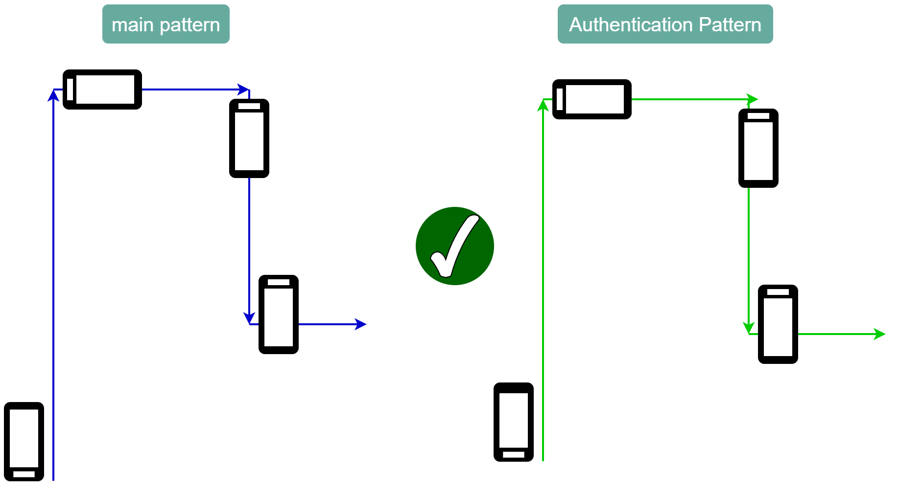
#### Scenario 2
In the second scenario, we exclude angular rotation and solely focus on movements along the x and y axes. Despite this simplification, the test remains successful because the authentication pattern mirrors the primary pattern accurately. 

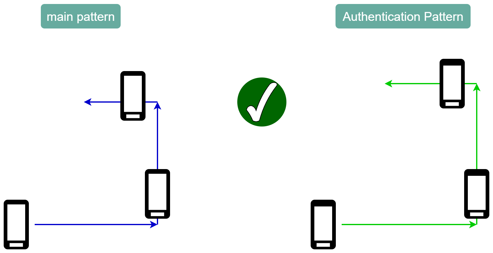
#### Scenario 3
In the third scenario, we eliminate angular rotation, but unfortunately, the test is not successful. As we can see, the path taken for the primary pattern differs from that of the authentication pattern. In the first upward movement, the authentication pattern moves much more than the original pattern, which isn't okay. Additionally, in the third movement, while the primary pattern moves upwards, the authentication pattern moves downwards so this test fails.

#### Scenario 4
In the fourth scenario, we encounter another example of an unsuccessful test. While the paths followed by the primary and authentication patterns match, there's a problem. In the primary pattern, we have a 90-degree rotation at the end of the first movement, which isn't replicated in the authentication pattern. So, this test fails.

## Results
Upon executing the code, the application runs on the mobile device, displaying the initial screen as shown in the figure below. The interface includes three buttons: `Calibrate`, `Record New Pattern`, and `Authenticate Pattern`. Initially, only the calibrate button is selectable. Pattern recording or authentication is not possible until calibration is completed.

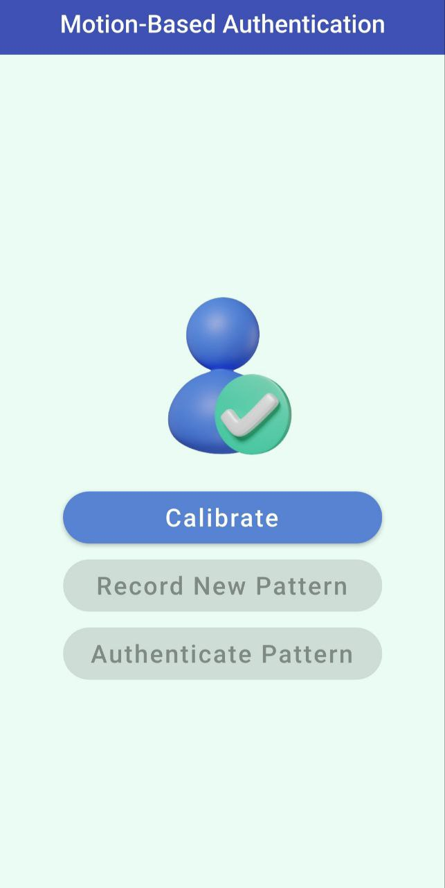

After the user touches the Calibrate button, the calibration process begins. Shortly thereafter, a message is displayed to the user indicating that calibration is complete. Once calibration is finished, the user can return to the main menu by using the Back button located at the top of the screen to perform other actions.

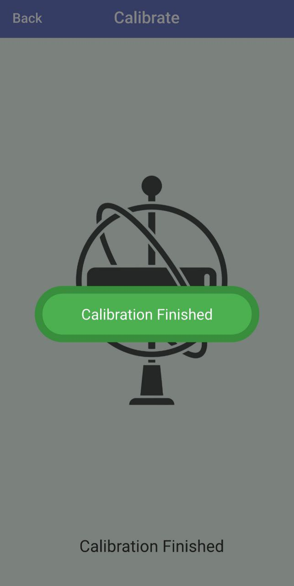

After returning to the main screen, the Record New Pattern button is now active, allowing the user to record the primary pattern. However, the Authenticate Pattern button remains inactive because the authentication process cannot proceed until the primary pattern has been recorded.

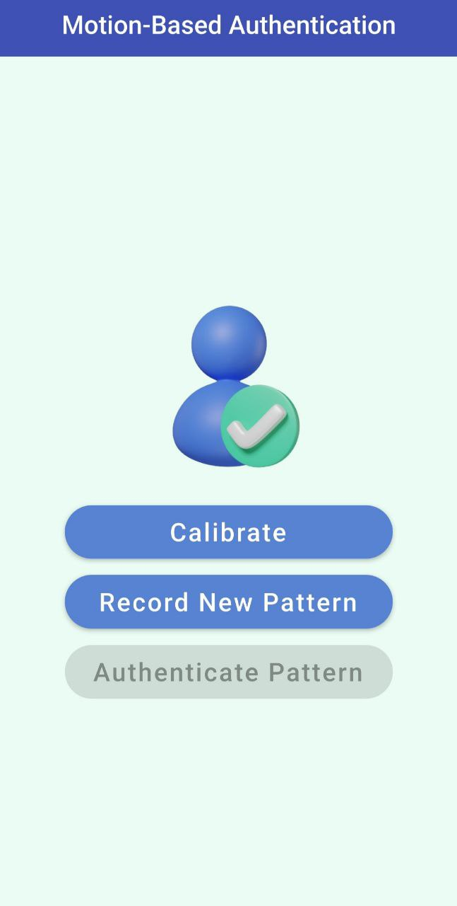

By pressing the Record New Pattern button, we can add the primary pattern and move the mobile phone as desired to create the intended pattern. After performing the pattern for a few seconds, a message indicating the successful recording of the pattern is displayed to the user, confirming that the pattern has been saved. Upon receiving this message, the user can return to the main screen to proceed with the next step, which is to verify authentication.

   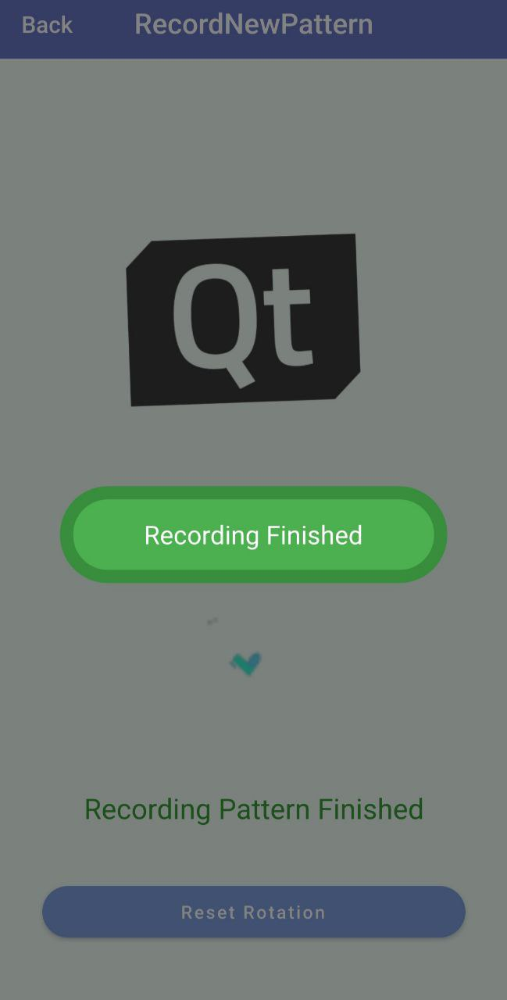
   

After returning to the main screen, all buttons are active. We can now perform authentication because both calibration has been completed and the primary pattern has been recorded.

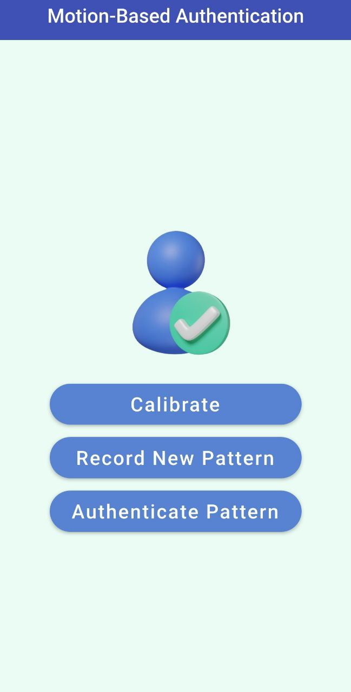

By pressing the Authentication Pattern button, the authentication process begins. As the user moves and rotates the mobile phone, all movements are recorded. To keep the user informed, the current stage of the process is displayed on the same screen. For example, one image indicates that the gyroscope sensor data is being analyzed, while another image shows that the accelerometer sensor data is being examined. This ensures that the user is kept aware of the progress throughout the process.

   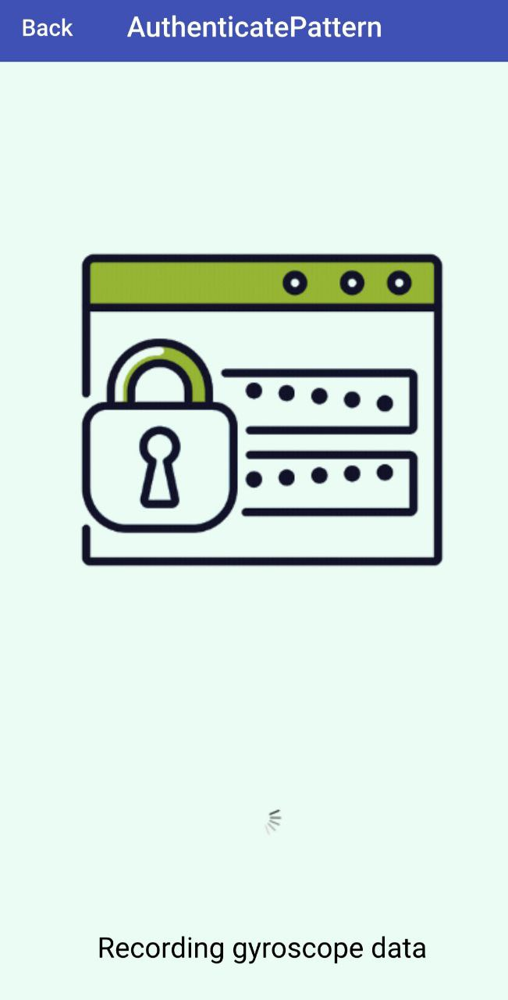
   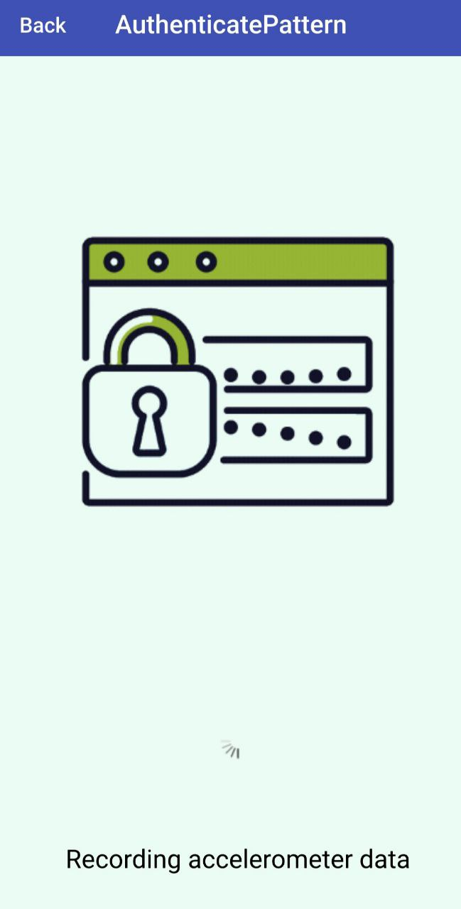

After recording the user's movement and comparing it with the primary pattern, if the authentication is unsuccessful, the following message is displayed to the user.

   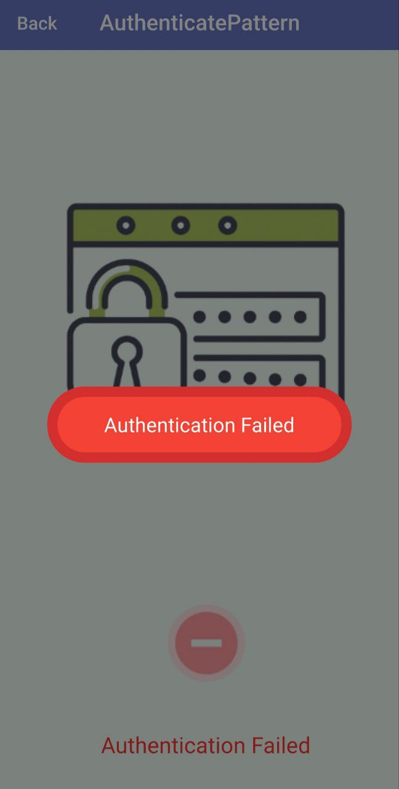
   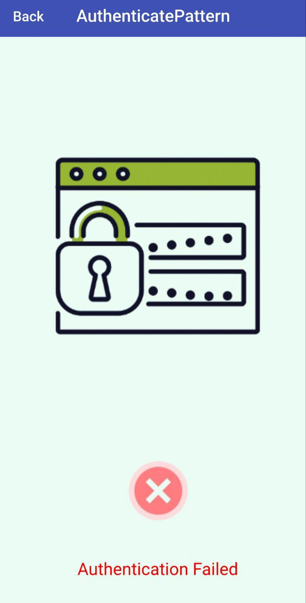

If the authentication pattern matches the primary pattern, the following message is displayed to the user, indicating that authentication has been successfully completed.

   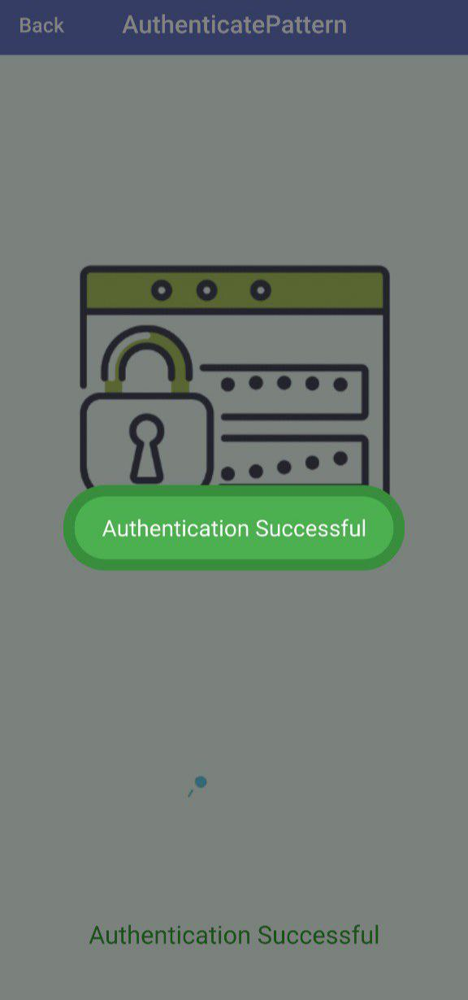
   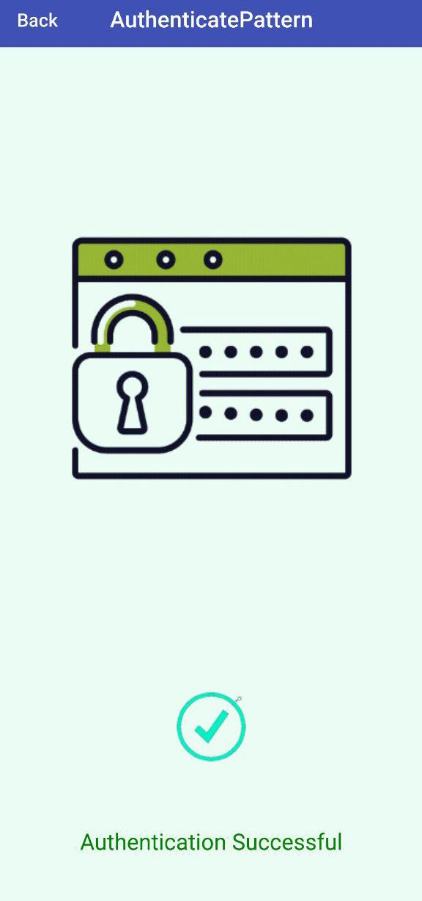

## References
- [Qt Documentation](https://doc.qt.io/qt-6/index.html)
- [Qt Quick Documentation](https://doc.qt.io/qt-6/qtquick-index.html)
- [Qt Sensors Documentation](https://doc.qt.io/qt-6/qtsensors-index.html)
- [Kalman Filter in Sensor Fusion](https://www.intechopen.com/chapters/49967)
- [Sensor Fusion in Android](https://developer.android.com/guide/topics/sensors/sensors_overview)
- [Perfetto Profiling Tool](https://perfetto.dev/docs/)
- [Perfetto Android Quick Start](https://perfetto.dev/docs/quickstart/android-tracing)

## Contributors
- [Nesa Abbasi](https://github.com/Nesabbasi): UI Design and Front-end of mobile application, Perfetto Profiling
- [Hadi Babalou](https://github.com/Hadi-loo): Back-end of mobile application, Logic of mobile application
- [Sana Navaei](https://github.com/SanaNavaei): UI Design and Front-end of mobile application, Documentation
- [Ava Mirmohammadmahdi](https://github.com/avamirm): Back-end of mobile application, Perfetto Profiling
